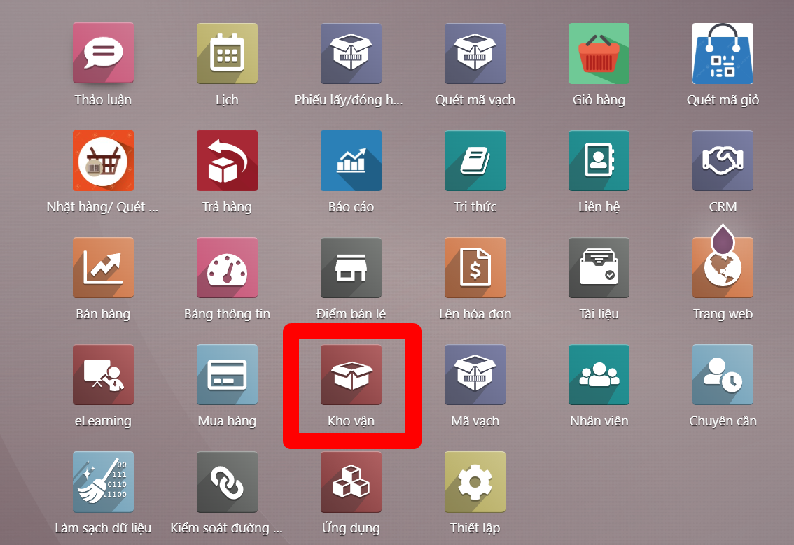
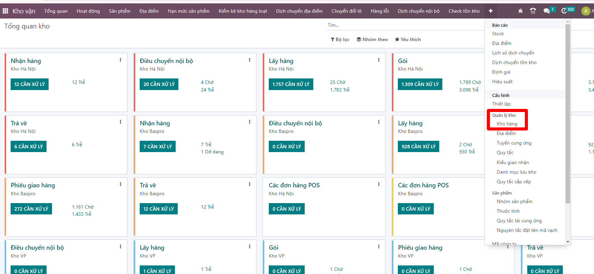
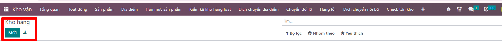
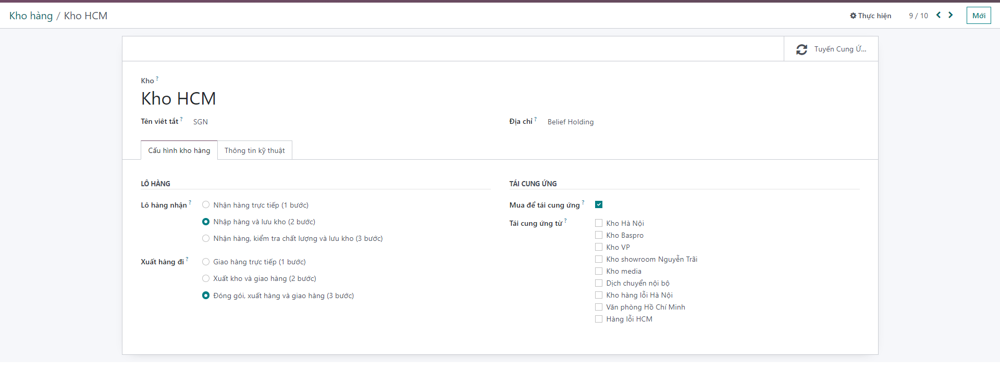
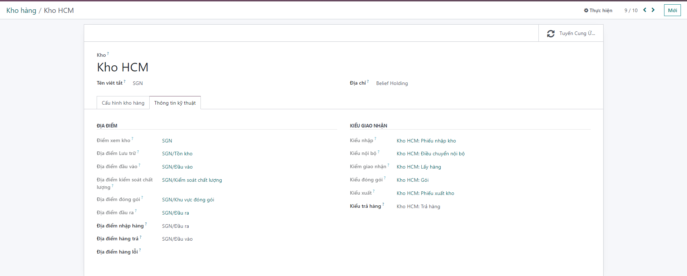
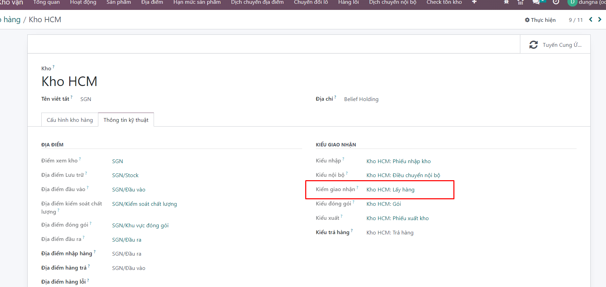
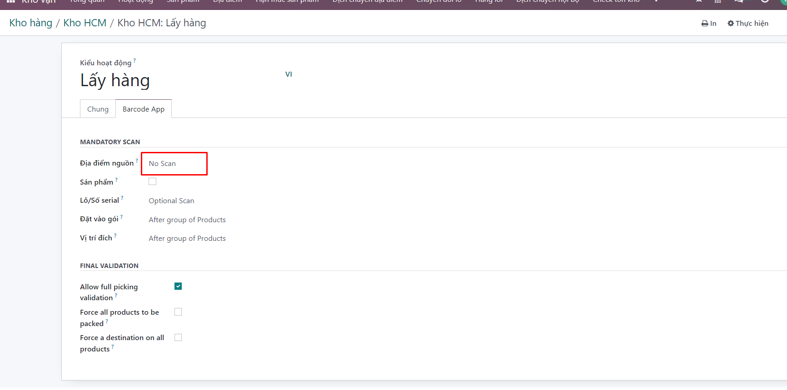
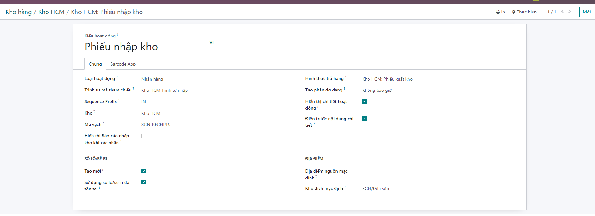
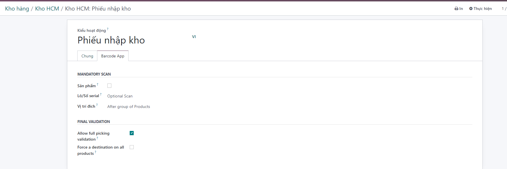

# Cấu hình kho mới ví dụ như kho "Hồ Chí Minh"
**Bước 1:** Tạo kho Hồ Chí Minh mã barcode SGN
```Kho vận >> Quản lý kho hàng >> Kho hàng```





**Bước 2:** Tạo địa điểm nhập hàng Hồ Chí Minh và cấu hình picking type nhận hàng hồ chí minh vào địa điểm này:



```Kho vận >> Quản lý kho hàng >> Kho hàng>> Cấu hình kho hàng```

**Nhập các thông tin khởi tạo kho:**

+ Tên kho.

+ Tên viết tắt.

+ Chọn hoặc tạo mới địa chỉ cho kho.

+ Thông tin Cấu hình kho hàng: chọn phương thức nhập và xuất hàng của kho. Hệ thống cho phép người dùng có thể lựa chọn một trong các phương thức nhận/xuất hàng 1 bước, 2 bước hoặc 3 bước, đáp ứng được nhu cầu hoạt động khác nhau của các kho.
    + Lô hàng nhận: Nhập hàng và lưu kho (2 bước)
    + Xuất hàng đi?: Đóng gói, xuất hàng và giao hàng (3 bước)
    + Mua để tái cung ứng?: tích chọn




```Kho vận >> Quản lý kho hàng >> Kho hàng>> Thông tin kỹ thuật```
Chứa thông tin về các địa điểm của kho đang khởi tạo. Các địa điểm này sẽ được tự động sinh ra khi kho được khởi tạo thành công
Ghi chú: Kiểm tra lại cấu hình các picking type (Kiểu giao nhận)


```Chú ý: Phần kiểu giao nhận, vào chi tiết Kho HCM: Lấy hàng>> Barcode app>. Địa điểm nguồn chọn No scan```: Mục đích cho việc nhặt hàng không cần quyét địa điểm nguồn SGN




Check thông tin phiếu nhập ```Kho vận >> Quản lý kho hàng >> Kho hàng>> Thông tin kỹ thuật>> Kiểu nhập?```





**Bước 3:** Người dùng kích nút LƯU để lưu và hoàn thiện việc tạo kho.


