# Cấu hình quyền

### Mục đích:
+ Cấu hình kho mặc định trong tài khoản của user
+ Pick chỉ show các phiếu của nhân viên thuộc kho đó
+ Nhân viên quét giỏ cũng sẽ chỉ add vào pick list của kho đó

**Bước 1** ```Menu>>Thiết lập>>Quy tắc truy cập```

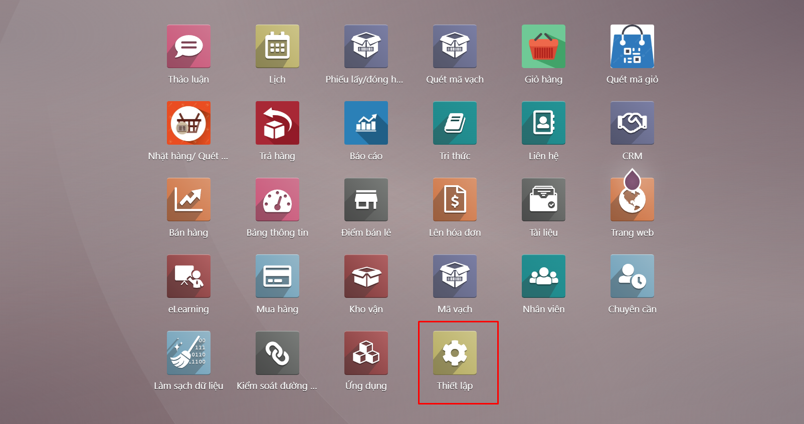

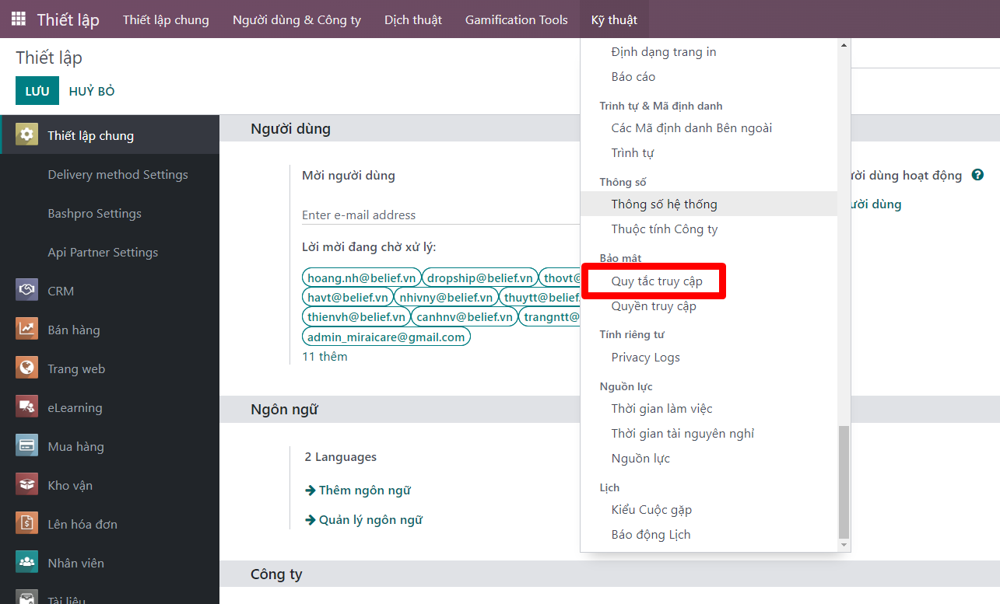

**Bước 2** access rule ```Warehouse show pick list``` cho các quyền của kho,

```Warehouse show all pick list``` system cho quyền system

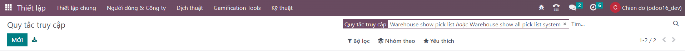
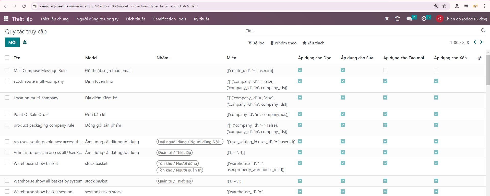

+ ```Warehouse show pick list``` thiết lập nhóm ```tồn kho/người dùng```

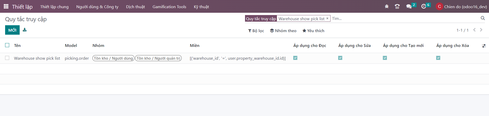
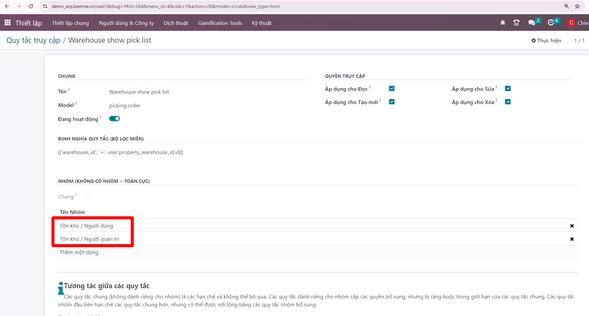

+ ```Warehouse show all pick list``` thiết lập nhóm ```tồn kho/Người quản trị```

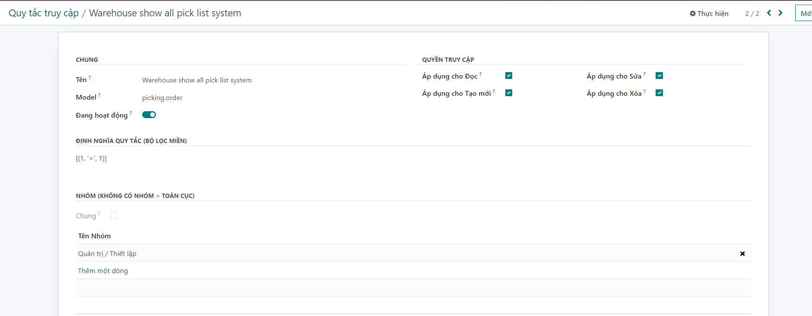


# Gán quyền cho user    
**Bước 1** ```Menu>>Thiết lập>>Người dùng```
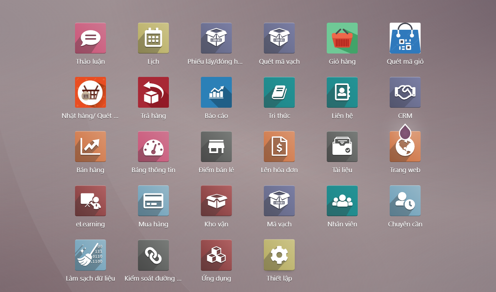
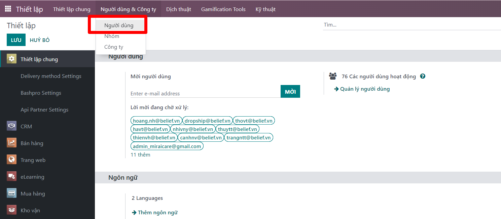
**Bước 2** Tìm kiếm user cần phân quyền

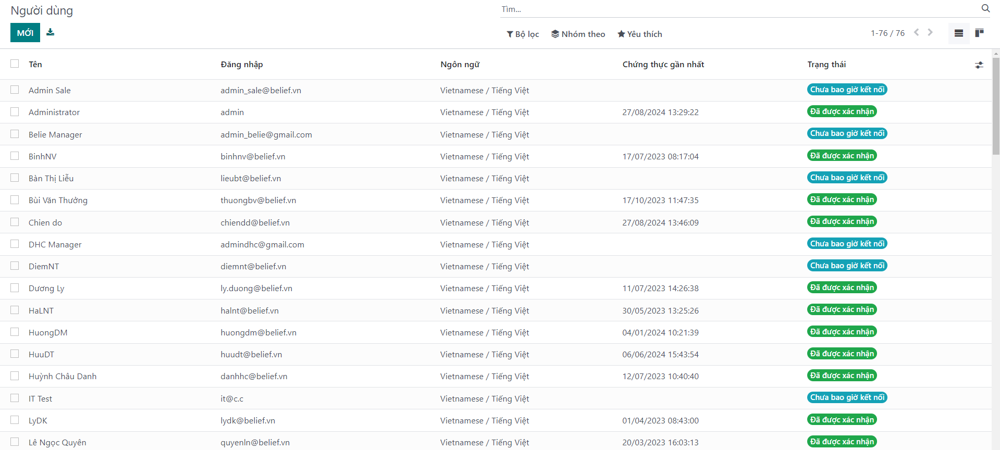
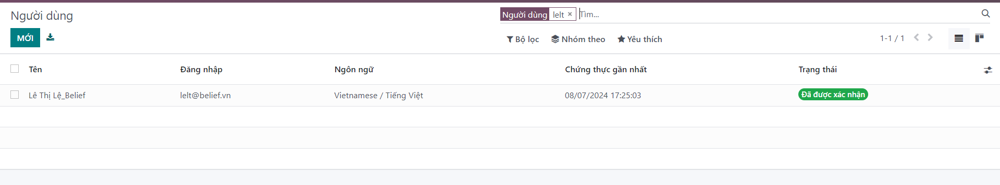

**Bước 3** Vào phần tủy chỉnh cá nhân/ gán Defaut warehouser= Kho HCM
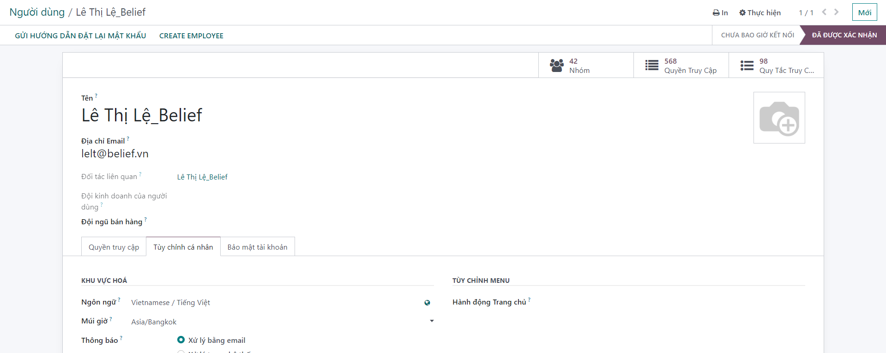
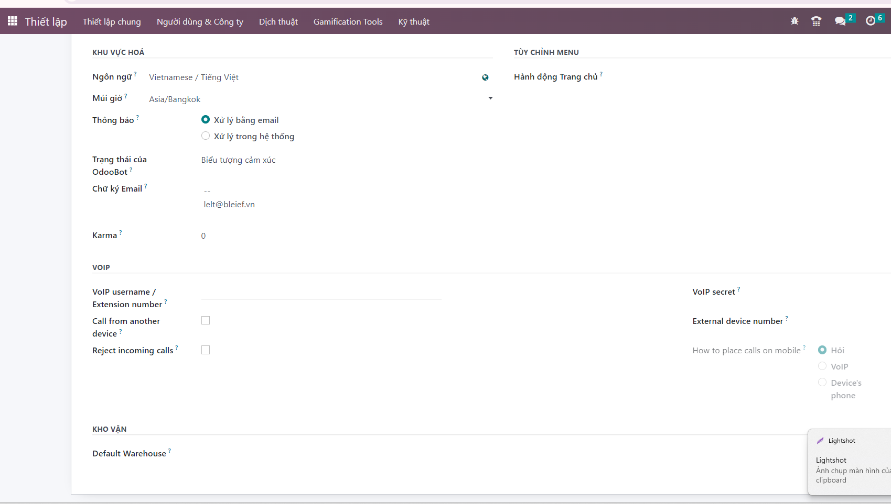
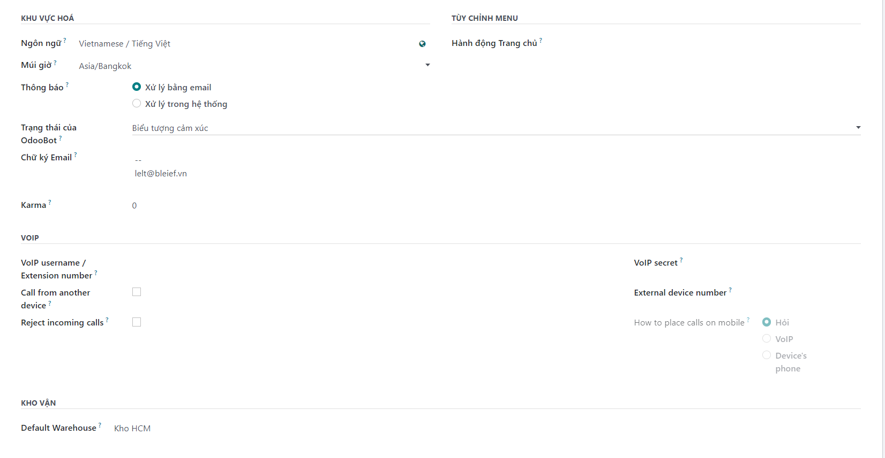