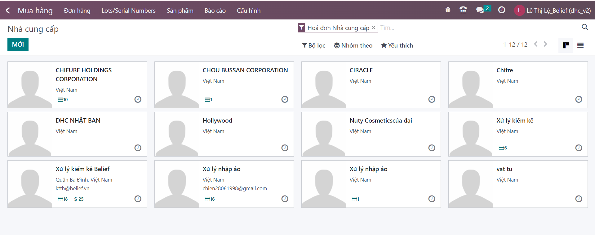
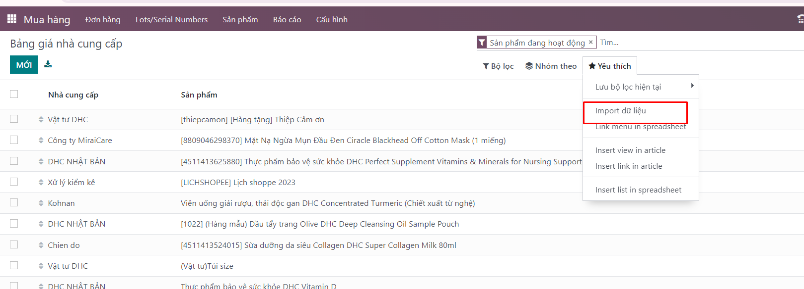

# 1. Số lô/sê-ri
Chức năng này quản lý số lô và hạn sử dụng của từng sản phẩm. Theo dõi hạn sử dụng sản phẩm để có kế hoạch bán và xuất hàng theo FEFO ```(FEFO là từ viết tắt của First Expired First Out, có nghĩa là hết hạn trước, xuất trước. )```

**Bước 1:** Người dùng vào menu: Mua hàng >> Lots/Serial Numbers 


**Bước 2:** Thêm mới lô hạn chưa có của một sản phẩm


**Bước 3:** Thêm thông tin 

+ Số lô
+ Sản phẩm
+ Ngày hết hạn


**Bước 4:** Lưu thông tin đã khai báo


# 2.import Số lô/sê-ri

**Bước 1:** hệ thống cung cấp file mẫu excel để người dùng nhập dữ liệu:
+ Vào mục import lô


**Bước 2:** Tải tập tin đúng định dạng lên (có thể lấy file mẫu ở nút bên cạnh nút ```Import lô```)



# 3.Tác vụ hỗ trợ việc theo dõi , thống kê
+ Hệ thống có hỗi trợ người dùng lọc thông tin tìm kiếm liên quan số lô vàn hạn sử dụng


+ Hỗ trợ nhóm dữ liệu theo người dùng cấu hình


+ Danh sách hiển thị hoặc ẩn một số trường mong muốn hoặc không mong muốn thấy màn danh sách



+ Ngoài ra mục ```Yêu thích``` hỗ trợ pin tìm kiếm theo cài đặt


+ Người dùng còn có thể ```Xuất toàn bộ``` sản phẩm có thông tin lô và hạn sử dụng

